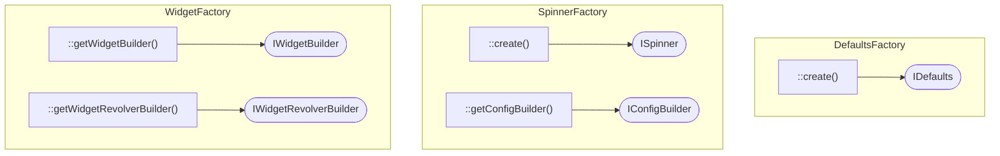

```mermaid
flowchart TD
    subgraph DefaultsFactory
    df1["::create()"]-->df2([IDefaults])
    end
    subgraph SpinnerFactory
    sf1["::create()"]-->sf2([ISpinner])
    sf3["::getConfigBuilder()"]-->sf4([IConfigBuilder])
    end
    subgraph WidgetFactory
    wf1["::getWidgetBuilder()"]-->wf2([IWidgetBuilder])
    wf3["::getWidgetRevolverBuilder()"]-->wf4([IWidgetRevolverBuilder])
    end
```

DefaultsFactory

SpinnerFactory (ConfigBuilder)

WidgetFactory (WidgetBuilder, WidgetRevolverBuilder)
