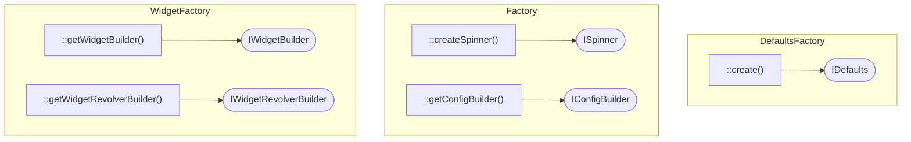
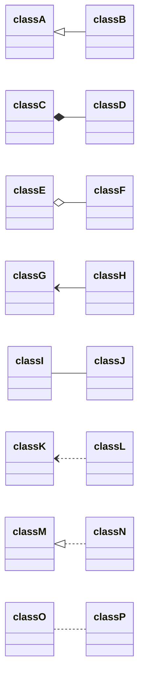

DefaultsFactory

Factory (ConfigBuilder)

WidgetFactory (WidgetBuilder, WidgetRevolverBuilder)

### Arrows samples
|    Type    |  Description  |
|:----------:|:-------------:|
| <&#124;--  |  Inheritance  |                         
|    *--	    |  Composition  |
|    o--	    |  Aggregation  |
|    -->	    |  Association  |
|    --	     | Link (Solid)  |
|    ..>	    |  Dependency   |
| ..&#124;>	 |  Realization  |
|    ..	     | Link (Dashed) |

