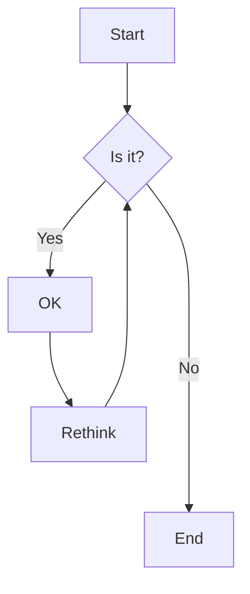
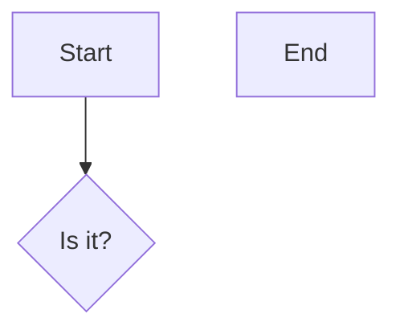

- DefaultsProvider created 
  - probing for event loop --> Loop settings

- Driver created by DriverFactory

- probing for event loop
  - ReactPHP            --> ReactPHP
  - Revolt              --> Revolt
  - No event loop found --> No Loop(Synchronous Mode)
- probing for output stream
  - symfony/console     --> STDERR(from symfony/console)
  - No output found     --> STDERR("native")
- probing for terminal color support
  - symfony/console     --> ANSI(from symfony/console)
  - No color support    --> ANSI("native")
