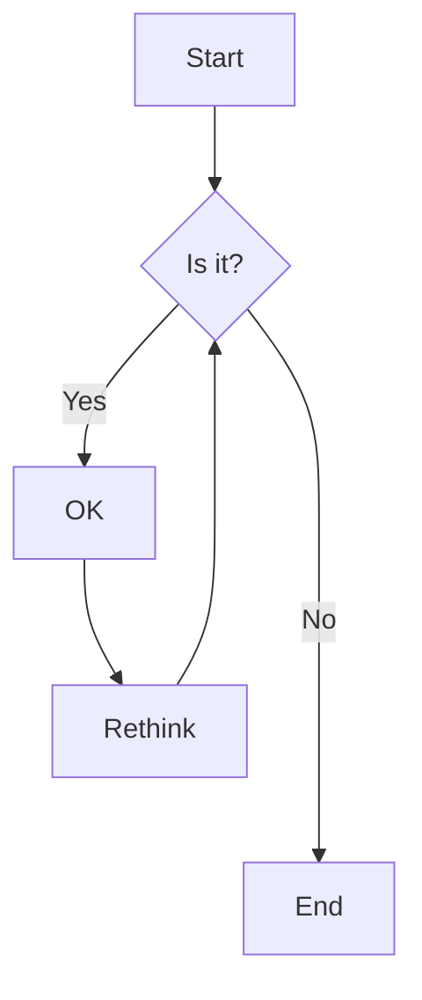
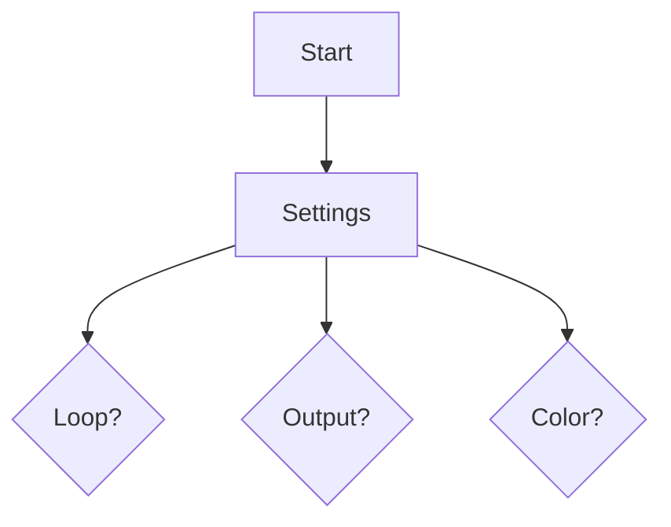
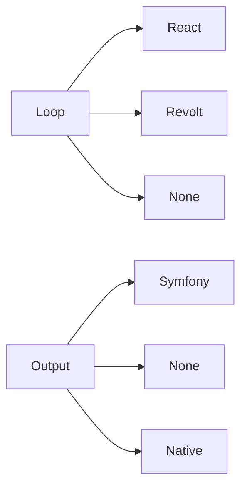

- SettingsProvider created 
  - probing for event loop --> Loop settings

- Driver created by DriverFactory

- probing for event loop
  - ReactPHP            --> ReactPHP
  - Revolt              --> Revolt
  - No event loop found --> No Loop(Synchronous Mode)
- probing for output stream
  - symfony/console     --> STDERR(from symfony/console)
  - No output found     --> STDERR("native")
- probing for terminal color support
  - symfony/console     --> ANSI(from symfony/console)
  - No color support    --> ANSI("native")

Loop:
- autodetect event loop (ReactPHP, Revolt, None)
- option:
  - attach handler(s) to loop - ENABLED/DISABLED (signal handler(s)), 🔧 **Default** ➜ ENABLED
  - autostart loop - ENABLED/DISABLED, 🔧 **Default** ➜ ENABLED
  - run mode (sync/async) - SYNCHRONOUS/ASYNC, 🔧 **Default** ➜ ASYNC

Output:
- autodetect stream (symfony/console, None), 🔧 **Default** ➜ stderr
  - custom stream (new feature)
- option:
  - show/hide cursor - VISIBLE/HIDDEN, 🔧 **Default** ➜ HIDDEN
  - clear screen - ENABLED/DISABLED (new feature), 🔧 **Default** ➜ DISABLED
  - initialization - ENABLED/DISABLED (execute all options for output?), 🔧 **Default** ➜ ENABLED

Color:
- autodetect color support (symfony/console, None), 🔧 **Default** ➜ ANSI8
- option:
  - color mode (AUTO, NONE, ANSI4, ANSI8, ANSI24), 🔧 **Default** ➜ AUTO
