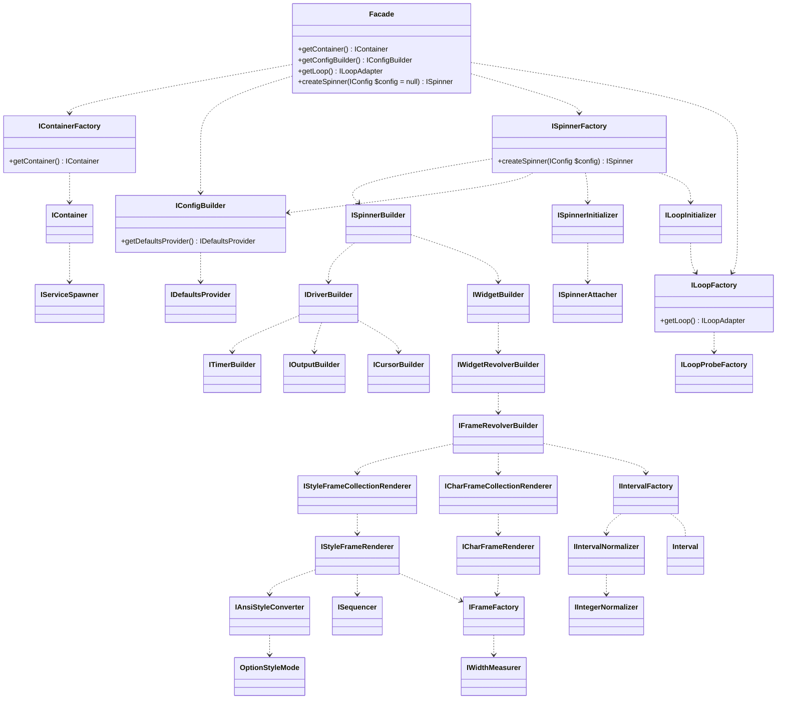

# Service hierarchy

ProceduralFrameRevolverBuilder ..> StyleFrameCollectionRenderer

ProceduralFrameRevolverBuilder ..> CharFrameCollectionRenderer

ProceduralFrameRevolverBuilder ..> IntervalFactory
