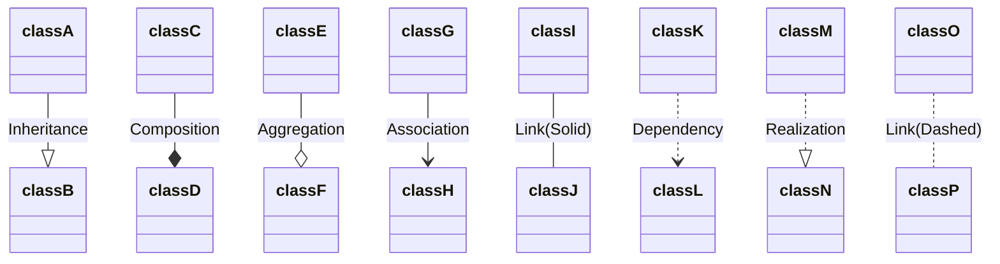
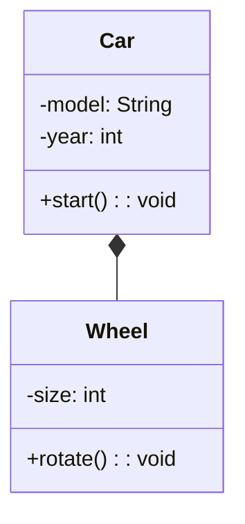

```mermaid
classDiagram
    direction TB
classA --|> classB : Inheritance
classC --* classD : Composition
classE --o classF : Aggregation
classG --> classH : Association
classI -- classJ : Link(Solid)
classK ..> classL : Dependency
classM ..|> classN : Realization
classO .. classP : Link(Dashed)
```

```mermaid
classDiagram
    class Car{
        -model: String
        -year: int
        +start(): void
    }
    class Wheel{
        -size: int
        +rotate(): void
    }
    Car *-- Wheel
```
