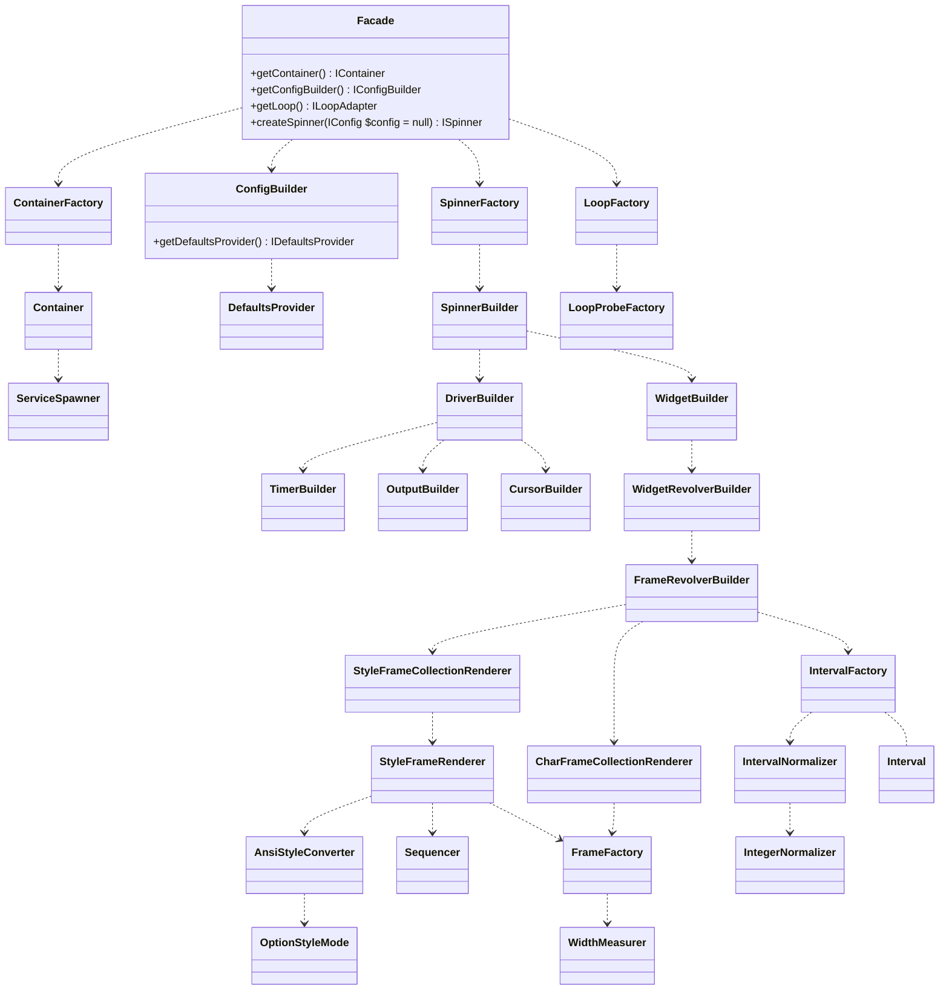

# Hierarchy

```mermaid
classDiagram
    direction TB
    Facade ..> ContainerFactory
    Facade ..> ConfigBuilder
    Facade ..> SpinnerFactory
    Facade ..> LoopFactory

    class Facade {
        +getContainer() IContainer
        +getConfigBuilder() IConfigBuilder
        +getLoop() ILoopAdapter
        +createSpinner(IConfig $config = null) ISpinner
    }
    
    ContainerFactory ..> Container

    Container ..> ServiceSpawner


    SpinnerFactory ..> SpinnerBuilder

    ConfigBuilder ..> DefaultsProvider
    
    class ConfigBuilder {
        +getDefaultsProvider() IDefaultsProvider
    }
    
    LoopFactory ..> LoopProbeFactory

    SpinnerBuilder ..> DriverBuilder
    SpinnerBuilder ..> WidgetBuilder

    DriverBuilder ..> TimerBuilder
    DriverBuilder ..> OutputBuilder
    DriverBuilder ..> CursorBuilder

    WidgetBuilder ..> WidgetRevolverBuilder

    WidgetRevolverBuilder ..> FrameRevolverBuilder

    FrameRevolverBuilder ..> StyleFrameCollectionRenderer
    FrameRevolverBuilder ..> CharFrameCollectionRenderer
    FrameRevolverBuilder ..> IntervalFactory

    IntervalFactory ..> IntervalNormalizer
    IntervalFactory .. Interval

    IntervalNormalizer ..> IntegerNormalizer

    StyleFrameCollectionRenderer ..> StyleFrameRenderer

    CharFrameCollectionRenderer ..> FrameFactory

    StyleFrameRenderer ..> AnsiStyleConverter
    StyleFrameRenderer ..> Sequencer
    StyleFrameRenderer ..> FrameFactory

    AnsiStyleConverter ..> OptionStyleMode

    FrameFactory ..> WidthMeasurer


```

ProceduralFrameRevolverBuilder ..> StyleFrameCollectionRenderer

ProceduralFrameRevolverBuilder ..> CharFrameCollectionRenderer

ProceduralFrameRevolverBuilder ..> IntervalFactory
