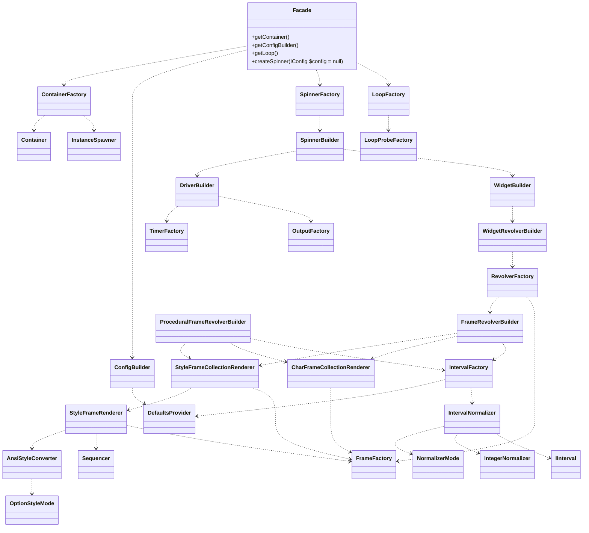

# Hierarchy

```mermaid
classDiagram
    direction TB
    Facade ..> ContainerFactory
    Facade ..> ConfigBuilder
    Facade ..> SpinnerFactory
    Facade ..> LoopFactory
    
    ContainerFactory ..> Container
    ContainerFactory ..> InstanceSpawner
    
    class Facade {
        +getContainer()
        +getConfigBuilder()
        +getLoop()
        +createSpinner(IConfig $config = null)
    }
    
    SpinnerFactory ..> SpinnerBuilder

    ConfigBuilder ..> DefaultsProvider

    LoopFactory ..> LoopProbeFactory
    
    SpinnerBuilder ..> DriverBuilder
    SpinnerBuilder ..> WidgetBuilder
    
    DriverBuilder ..> TimerFactory
    DriverBuilder ..> OutputFactory
    
    WidgetBuilder ..> WidgetRevolverBuilder
    
    WidgetRevolverBuilder ..> RevolverFactory
    
    RevolverFactory ..> FrameRevolverBuilder
    RevolverFactory ..> FrameFactory
    
    FrameRevolverBuilder ..> StyleFrameCollectionRenderer
    FrameRevolverBuilder ..> CharFrameCollectionRenderer
    FrameRevolverBuilder ..> IntervalFactory
    
    IntervalFactory ..> DefaultsProvider
    IntervalFactory ..> IntervalNormalizer
    
    IntervalNormalizer ..> NormalizerMode
    IntervalNormalizer ..> IntegerNormalizer
    IntervalNormalizer ..> IInterval
    
    StyleFrameCollectionRenderer ..> StyleFrameRenderer
    StyleFrameCollectionRenderer ..> FrameFactory
    
    CharFrameCollectionRenderer ..> FrameFactory
    
    StyleFrameRenderer ..> AnsiStyleConverter
    StyleFrameRenderer ..> Sequencer
    StyleFrameRenderer ..> FrameFactory
    
    AnsiStyleConverter ..> OptionStyleMode
    
    
    ProceduralFrameRevolverBuilder ..> StyleFrameCollectionRenderer
    ProceduralFrameRevolverBuilder ..> CharFrameCollectionRenderer
    ProceduralFrameRevolverBuilder ..> IntervalFactory
    
```
