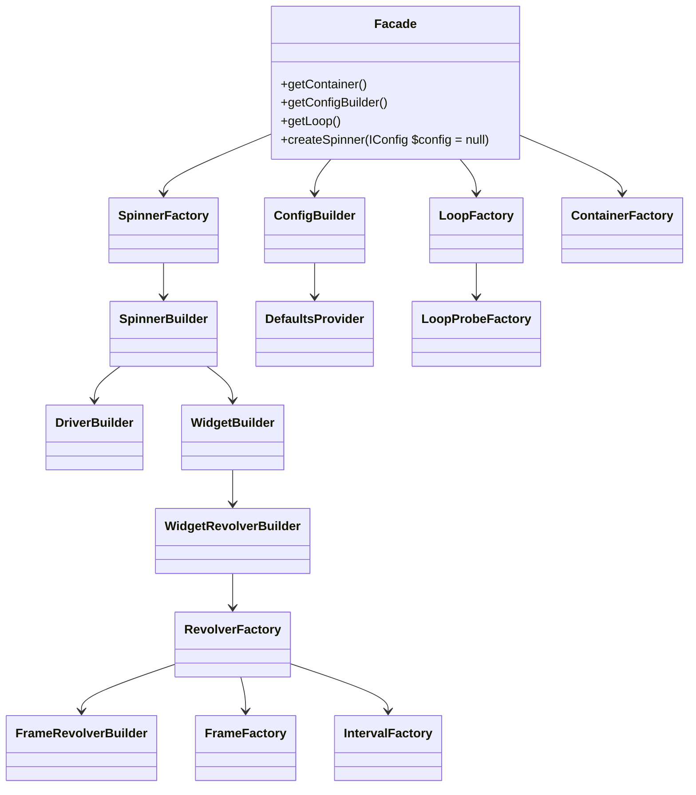

# Hierarchy

```mermaid
classDiagram
    direction TB
    Facade --> SpinnerFactory
    Facade --> ConfigBuilder
    Facade --> LoopFactory
    Facade --> ContainerFactory
    class Facade{
        +getContainer()
        +getConfigBuilder()
        +getLoop()
        +createSpinner(IConfig $config = null)
    }
    
    SpinnerFactory --> SpinnerBuilder

    ConfigBuilder --> DefaultsProvider

    LoopFactory --> LoopProbeFactory
    
    SpinnerBuilder --> DriverBuilder
    SpinnerBuilder --> WidgetBuilder
    
    WidgetBuilder --> WidgetRevolverBuilder
    
    WidgetRevolverBuilder --> RevolverFactory
    
    RevolverFactory --> FrameRevolverBuilder
    RevolverFactory --> FrameFactory
    RevolverFactory --> IntervalFactory

```
